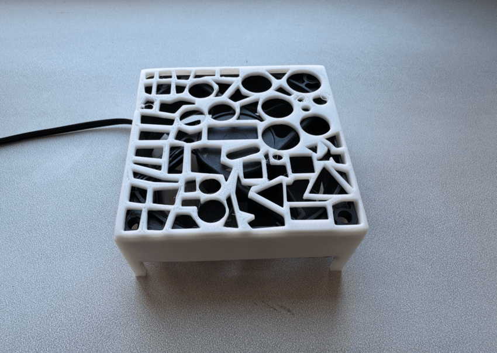
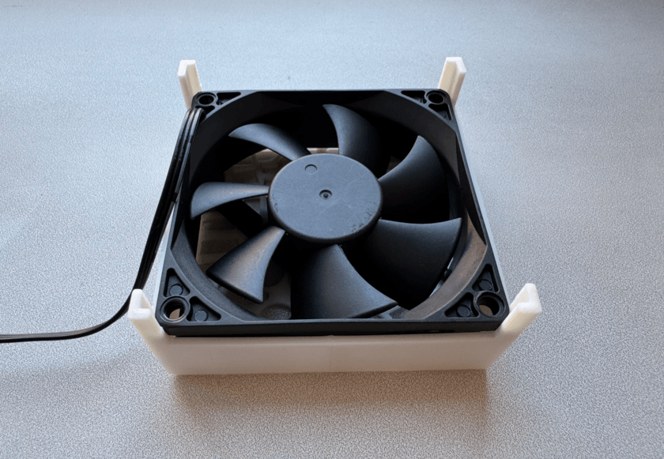

# Digma DFAN-80: USB-C PD Power and Operating Cost

<p align="center">
  
  
</p>

Below is a compact page about the device: what this cooler is, how to power it separately from a PC, how to connect it via a USB-C PD trigger, and how much 1 hour of operation costs at different voltages.

## Bill of Materials

| Part | Price |
|---|---:|
| USB-C PD charger, 33 W | 394 RUB |
| USB-C PD/QC trigger (5 / 9 / 12 / 15 / 20 V, up to 65 W), with voltage selector | 321 RUB |
| Digma DFAN-80 case fan, 80 mm | 211 RUB |
| 3D-printed enclosure (self-made) | 0 RUB |
| **Total** | **926 RUB** |

## Device

The Digma DFAN-80 cooler is a 12 V case fan with a rated power of 1.44 W.[1][2]  
From this, the nominal current at 12 V is:

$$
I = \frac{P}{U} = \frac{1.44}{12} \approx 0.12\,A
$$

This means the fan needs 12 V DC for normal operation, and the current draw is relatively low.

## Connectors and Wires

This fan typically has:

- 3-pin fan connector — power and tachometer signal.
- 4-pin Molex — alternative power from the PC power supply.

Only two contacts are needed to run it:

- `+12V`
- `GND`

The third wire on the 3-pin connector is the tachometer signal; the motherboard uses it to read RPM, and it is not required for standalone fan power.

## Connecting Outside a Computer

### USB-C PD Trigger Option

A regular USB-C power adapter does not output 12 V continuously on its own: the required voltage must be requested via the USB Power Delivery protocol. For this, a PD trigger is used — a small board or adapter that requests the needed voltage profile from the charger, for example 12 V.

The connection scheme is:

```text
[220 V outlet]
      |
      v
[USB-C PD power adapter]
      |
      | USB-C cable
      v
[PD trigger: request 12 V]
      |
      | +12V / GND
      v
[Digma DFAN-80 cooler]
```

In practice, this means:

1. A USB-C cable goes from the power adapter to the PD trigger.
2. The trigger switches the output to 12 V mode if the power adapter supports that profile.
3. Two wires from the trigger output go to the cooler: `+12V` to the fan power and `GND` to ground.
4. The third fan wire is not connected.

### Simplified ASCII Wiring Diagram

```text
USB-C PD adapter
    |
    | USB-C
    v
+-------------------+
|   PD Trigger 12V  |
|                   |
|   V+  ----------+-----------------> cooler +12V
|   GND ---------+------------------> cooler GND
+-------------------+

Do not connect the third fan wire (tach)
```

## Power Consumption Calculation

Energy consumed is calculated as:

$$
E = P \times t
$$

where `E` is energy in kWh, `P` is power in kW, and `t` is time in hours.

Cost is calculated as:

$$
\text{Cost} = E \times \text{Rate}
$$

Rates used for calculation:

- Daytime: 8.24 RUB/kWh
- Nighttime: 3.54 RUB/kWh

## Calculation for 12 V

The rated cooler power at 12 V is 1.44 W, or 0.00144 kW.

For 1 hour of operation:

$$
E = 0.00144 \times 1 = 0.00144\,kWh
$$

Cost per hour:

- Daytime: `0.00144 × 8.24 = 0.0118656 RUB` ≈ **0.012 RUB/h**
- Nighttime: `0.00144 × 3.54 = 0.0050976 RUB` ≈ **0.0051 RUB/h**

## Estimate for 9 V and 5 V

Actual power consumption at 9 V and 5 V depends on the motor's real operating mode and should be measured by current, but at lower voltage it will be below the rated 12 V power. For a simple engineering estimate, it is convenient to use a current proportion at the same nominal resistance, i.e. calculate power as:

$$
P \approx U \times I, \quad I \approx 0.12\,A
$$

This is a rough estimate, but it works for a household cost calculation.

| Voltage | Estimated power | Energy per 1 h | Daytime cost | Nighttime cost |
|---|---:|---:|---:|---:|
| 5 V | 0.60 W | 0.00060 kWh | 0.00494 RUB | 0.00212 RUB |
| 9 V | 1.08 W | 0.00108 kWh | 0.00890 RUB | 0.00382 RUB |
| 12 V | 1.44 W | 0.00144 kWh | 0.01187 RUB | 0.00510 RUB |

These values show that even at the rated 12 V, the fan is very cheap to run — noticeably less than one kopeck per hour at the daytime rate.

## Practical Notes

- If you simply cut a USB cable and connect the cooler directly, without a PD trigger you will usually get only 5 V on USB-C.
- For normal operation of this fan, you specifically need 12 V mode, which must be requested by the PD trigger.
- Before connecting, it is advisable to check the trigger output with a multimeter and make sure it is actually 12 V and the polarity is correct.
- The third fan wire is left unconnected unless RPM reading is required.

## Short Summary

For standalone use of the Digma DFAN-80, the most convenient setup is: `outlet -> USB-C PD adapter -> 12 V PD trigger -> cooler`. 
At rated 12 V operation, the fan consumes 1.44 W and costs approximately 0.012 RUB per hour during the day or 0.0051 RUB per hour at night.

## Planned Improvements (v2)

- **Enclosure walls:** Reduce wall thickness to the minimum required for structural integrity. The current design uses more material than necessary.
- **Airflow distribution:** The perforated top grille works well visually, but the fan hub blocks airflow at the center, leaving that zone effectively dead. In practice, cooling only works when the device is placed near the pad edges. Rework the vent pattern and internal airflow path to deliver even flow across the full support surface.
- **Fan speed control:** Add adjustable output voltage — manual or automatic — to regulate airflow intensity.
